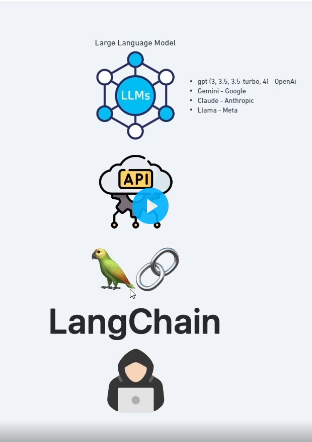
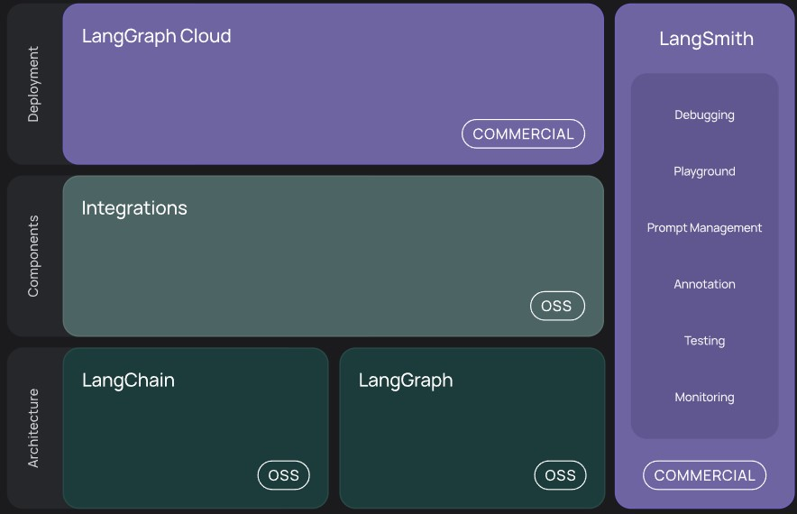

# quickstart_api_openai
 

## LangChain
### Introdução
LangChain é uma estrutura para desenvolvimento de aplicativos baseados em grandes modelos de linguagem (LLMs).

O LangChain simplifica cada estágio do ciclo de vida do aplicativo LLM:

*Desenvolvimento* : Crie seus aplicativos usando os blocos de construção de código aberto , componentes e integrações de terceiros do LangChain . Use o LangGraph para criar agentes com estado com streaming de primeira classe e suporte humano no loop.
 *Produção* : use o LangSmith para inspecionar, monitorar e avaliar suas cadeias, para que você possa otimizar e implantar continuamente com confiança.
 *Implantação* : transforme seus aplicativos LangGraph em APIs e assistentes prontos para produção com o LangGraph Cloud .
Diagrama descrevendo a organização hierárquica da estrutura LangChain, exibindo as partes interconectadas em várias camadas.

Concretamente, a estrutura consiste nas seguintes bibliotecas de código aberto:

*langchain-core*: Abstrações básicas e linguagem de expressão LangChain.
 *langchain-community*: Integrações de terceiros.
Pacotes de parceiros (por exemplo langchain-openai, langchain-anthropic, , etc.): Algumas integrações foram divididas em seus próprios pacotes leves que dependem apenas de langchain-core.
 *langchain*: Cadeias, agentes e estratégias de recuperação que compõem a arquitetura cognitiva de um aplicativo.
 *LangGraph* : Crie aplicativos multiator robustos e com estado com LLMs modelando etapas como arestas e nós em um gráfico. Integra-se suavemente com o LangChain, mas pode ser usado sem ele.
 *LangServe* : Implante cadeias LangChain como APIs REST.
 *LangSmith* : uma plataforma de desenvolvedor que permite depurar, testar, avaliar e monitorar aplicativos LLM.

referência
https://python.langchain.com/v0.2/docs/introduction/